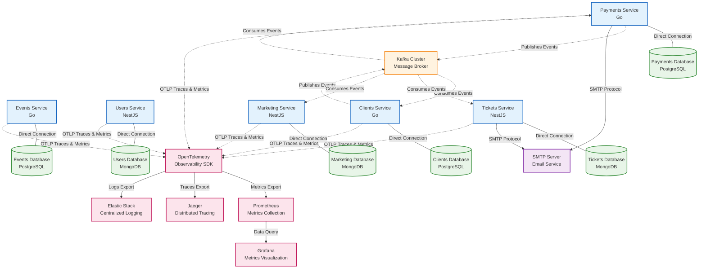

# Event Tickets Platform 🎫

Event tickets is a microservices-based platform for managing event ticketing, user registrations, payments, ticket generation, and marketing automation. The platform is built using Go and NestJS, leveraging PostgreSQL and MongoDB for data storage, and Kafka for inter-service communication. It includes robust monitoring and observability features using OpenTelemetry, Prometheus, Grafana, Jaeger, and the ELK stack.

## Architecture Overview





## 📋 Service Overview

### 🎪 Events Service (Go + PostgreSQL)
**Port: 3001**
- **Purpose**: Manage event creation, updates, and retrieval
- **Key Features**:
  - JWT-based authentication
  - CRUD operations for events
  - Pagination support
  - Role-based access control
- **Database**: PostgreSQL
- **Architecture**: Clean Architecture with Domain-Driven Design

### 👥 Users Service (NestJS + MongoDB)
**Port: 3000**
- **Purpose**: User registration, authentication, and management
- **Key Features**:
  - User registration and authentication
  - JWT token management
  - Password hashing with bcrypt
  - Clean architecture with CQRS
- **Database**: MongoDB
- **Patterns**: CQRS, Repository Pattern

### 💳 Payments Service (Go + PostgreSQL)
**Port: 3000**
- **Purpose**: Handle payment processing and transaction management
- **Key Features**:
  - Payment creation and processing
  - Transaction simulation
  - Multi-language email notifications
  - Event-driven payment flows
- **Database**: PostgreSQL
- **Architecture**: Clean Architecture

### 🤝 Clients Service (Go + PostgreSQL)
**Port: 3004**
- **Purpose**: Manage client information and trigger ticket generation
- **Key Features**:
  - Client creation from successful payments
  - Event-driven client management
  - Integration with ticket generation
- **Database**: PostgreSQL
- **Architecture**: Clean Architecture

### 🎫 Tickets Service (NestJS + MongoDB)
**Port: 4001**
- **Purpose**: Generate and deliver tickets via email
- **Key Features**:
  - UUID-based ticket passports
  - HTML email templates
  - Multi-language support (EN/PT)
  - Kafka message consumption
- **Database**: MongoDB
- **Integration**: NodeMailer for email delivery

### 📢 Marketing Service (NestJS + MongoDB)
**Port: 3005**
- **Purpose**: Manage marketing leads and track conversions
- **Key Features**:
  - Lead creation and management
  - Conversion tracking from client events
  - REST API for lead operations
- **Database**: MongoDB
- **Patterns**: Domain-Driven Design with CQRS

## 🛠️ Technology Stack

### Backend Technologies
- **Go 1.24**: Events, Payments, Clients services
- **NestJS**: Users, Tickets, Marketing services
- **TypeScript**: Node.js services

### Databases
- **PostgreSQL 14**: Structured data (Events, Payments, Clients)
- **MongoDB**: Document-based data (Users, Tickets, Marketing)

### Message Broker
- **Apache Kafka**: Event-driven communication between services

### Observability & Monitoring
- **OpenTelemetry**: Distributed tracing and metrics
- **Jaeger**: Tracing visualization
- **Prometheus**: Metrics collection
- **Grafana**: Metrics dashboards and visualization
- **ELK Stack**: Centralized logging
  - **Elasticsearch**: Log storage and indexing
  - **Kibana**: Log visualization
  - **Filebeat**: Log shipping

### DevOps & Deployment
- **Docker**: Containerization
- **Docker Compose**: Multi-service orchestration

## 🚀 Quick Start

### Prerequisites
- Docker and Docker Compose
- Go 1.24+ (for local development)
- Node.js 23+ (for local development)

### 1. Clone the Repository
```bash
git clone <repository-url>
cd event-tickets
```

### 2. Set Up Environment Variables
Each service has its own environment configuration:

```bash
# Events Service
cp events/.env_example events/.env

# Users Service
cp users/.env.example users/.env

# Payments Service
cp payments/.env_example payments/.env

# Clients Service
cp clients/.env_example clients/.env

# Tickets Service
cp tickets/.env-example tickets/.env

# Marketing Service
cp marketing/.env-example marketing/.env
```

### 3. Create Docker Secrets
Each service requires Docker secrets for sensitive data:

```bash
# Example for any service
mkdir -p <service>/.docker/secrets
echo "your_password" > <service>/.docker/secrets/postgres_password.txt
echo "admin" > <service>/.docker/secrets/grafana_user.txt
echo "admin" > <service>/.docker/secrets/grafana_password.txt
```

### 4. Start Services
You can start each service individually or create a master docker-compose file:

```bash
# Start individual services
cd events && docker-compose up -d
cd ../users && docker-compose up -d
cd ../payments && docker-compose up -d
# ... repeat for other services
```

## 📊 Monitoring & Observability

### Service Ports
- **Events Service**: http://localhost:3001
- **Users Service**: http://localhost:3000
- **Payments Service**: http://localhost:3000
- **Clients Service**: http://localhost:3004
- **Tickets Service**: http://localhost:4001
- **Marketing Service**: http://localhost:3005

### Monitoring Dashboards
- **Grafana**: http://localhost:3001 or 3006 (varies by service)
- **Jaeger**: http://localhost:16686
- **Kibana**: http://localhost:5601
- **Prometheus**: http://localhost:9090

### API Documentation
Each service provides Swagger documentation at `/api` endpoint.

## 🔐 Security Features

- **JWT Authentication**: Token-based authentication across services
- **Password Hashing**: Bcrypt for secure password storage
- **Input Validation**: Comprehensive request validation
- **Environment Secrets**: Secure handling of sensitive configuration
- **Docker Secrets**: Container-level secret management

## 🧪 Testing

Each service includes comprehensive testing:

```bash
# Go services
go test ./...
go test -cover ./...

# NestJS services
npm run test
npm run test:cov
npm run test:e2e
```
